<p align="center">
  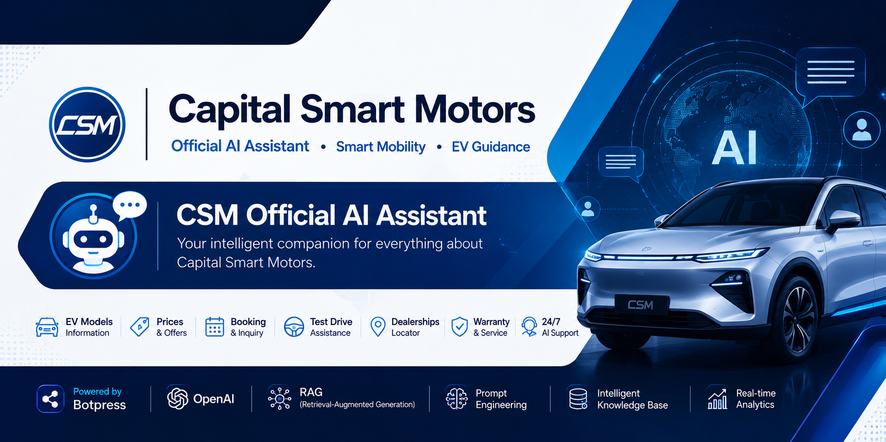
</p>

<h1 align="center"> CSM Official AI Assistant</h1>

<p align="center">
Enterprise AI Customer Support Platform for Capital Smart Motors
</p>

<p align="center">


</p>

---

# 📖 Project Overview

The **CSM Official AI Assistant** is an enterprise AI-powered customer support platform developed for **Capital Smart Motors (CSM)** to enhance customer engagement and automate responses to frequently asked questions. The assistant provides accurate, context-aware information regarding electric vehicles, dealership services, bookings, warranties, company details, and customer support through natural language conversations.

The project was built using **Botpress Cloud**, **OpenAI Language Models**, and **Retrieval-Augmented Generation (RAG)** techniques to combine structured company knowledge with intelligent response generation. Information is retrieved from custom knowledge bases, website-crawled content, and curated datasets to improve accuracy while reducing incorrect or hallucinated responses.

Unlike a traditional rule-based chatbot, the assistant understands user intent, retrieves relevant business knowledge, and generates conversational responses that closely resemble interactions with a human customer support representative.

---

# 🚀 Project Highlights

- Developed an AI-powered customer support assistant for Capital Smart Motors.
- Built using Botpress Cloud with OpenAI language models.
- Implemented Retrieval-Augmented Generation (RAG) for accurate responses.
- Integrated official website knowledge through website crawling.
- Designed a custom knowledge base using structured company documents.
- Deployed as a responsive web chatbot with branded user interface.
- Included conversation analytics and monitoring for continuous improvement.

---

# 🎯 Project Objectives

- Develop an intelligent AI assistant for Capital Smart Motors.
- Automate customer support for common business inquiries.
- Improve response accuracy using Retrieval-Augmented Generation (RAG).
- Integrate official website knowledge into the AI assistant.
- Provide users with instant assistance regarding EV models, services, warranties, dealerships, and bookings.
- Deliver a scalable AI solution that can be deployed directly on the company's website.

---

# 🌟 Key Features

- 🤖 AI-powered customer support
- 🧠 Retrieval-Augmented Generation (RAG)
- 🌐 Website knowledge crawling
- 📚 Custom knowledge base integration
- 🔍 Intelligent information retrieval
- 💬 Natural language conversations
- 🚗 Electric vehicle guidance
- 📍 Dealership information
- 📅 Test drive & booking guidance
- 🛠 Warranty and service assistance
- 📊 Conversation analytics
- 📈 Performance monitoring
- 🌍 Responsive web deployment
- 🎨 Custom branded chat interface
- ⚡ Real-time AI responses

---

# 🛠 Technology Stack

| Category | Technologies |
|----------|--------------|
| AI Platform | Botpress Cloud |
| Language Model | OpenAI |
| AI Technique | Retrieval-Augmented Generation (RAG) |
| Knowledge Sources | Website Crawling, Custom Knowledge Base, Structured Text Files |
| Deployment | Botpress Webchat |
| Frontend Integration | HTML, JavaScript |
| Analytics | Botpress Analytics Dashboard |
| Monitoring | Conversation Monitoring |
| Documentation | Markdown |

---

# 🏗 System Architecture

The AI assistant follows a Retrieval-Augmented Generation (RAG) architecture that combines multiple knowledge sources with OpenAI language models to generate accurate and context-aware responses.

<p align="center">
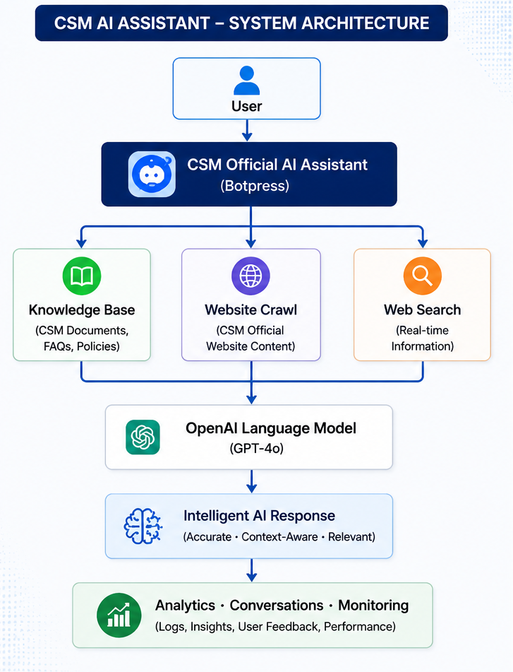
</p>

---

# 🔄 System Workflow

The chatbot processes user queries through a structured retrieval pipeline before generating a response.

<p align="center">
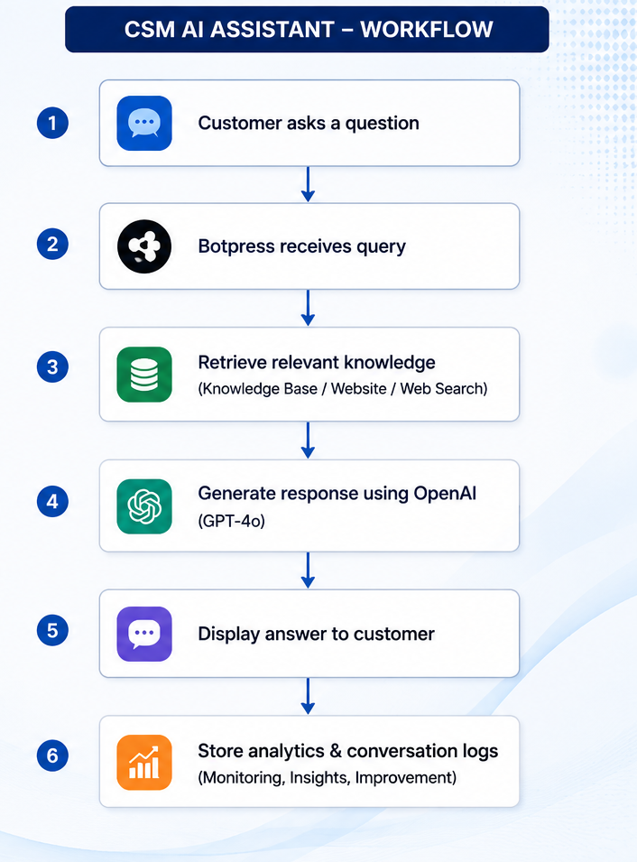
</p>

---

# 📸 Project Screenshots

## Dashboard Overview

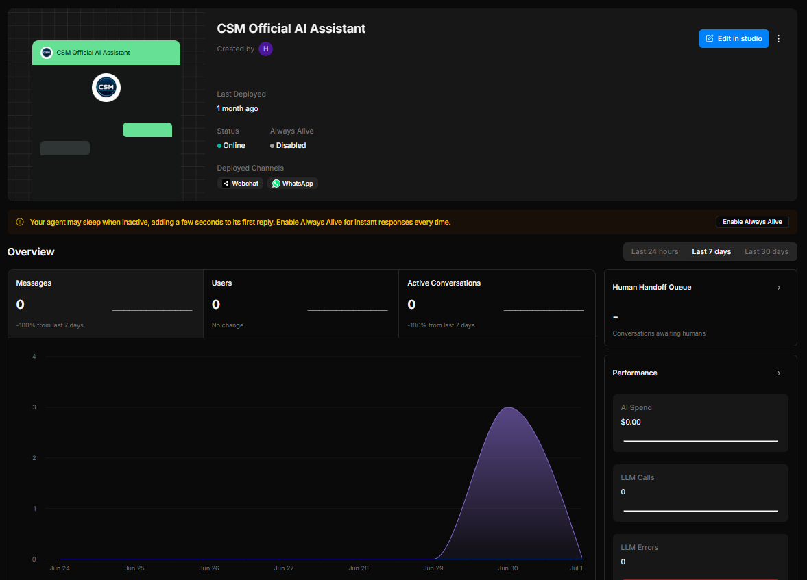

---

## Conversation Analytics

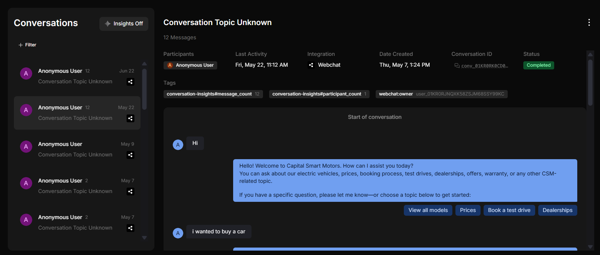

---

## Analytics Dashboard

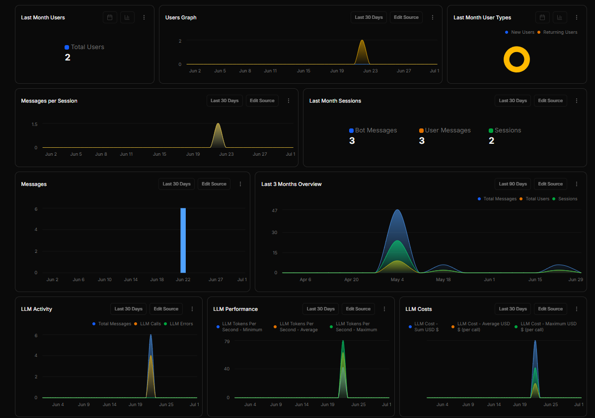

---

## Knowledge Base

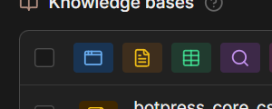

---

## File Management

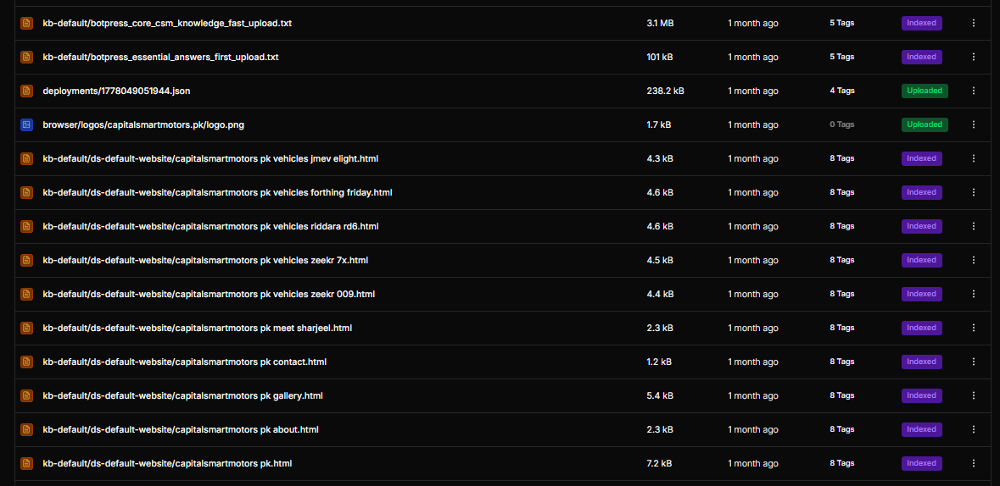

---

## Deployment Settings

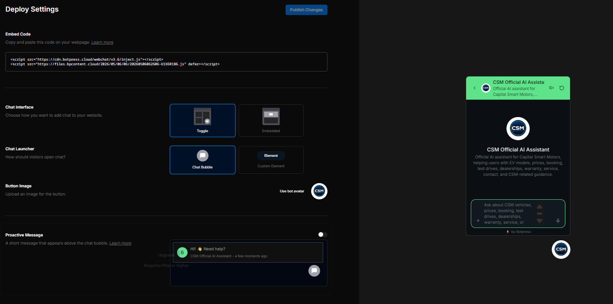

---

## Chatbot Interface

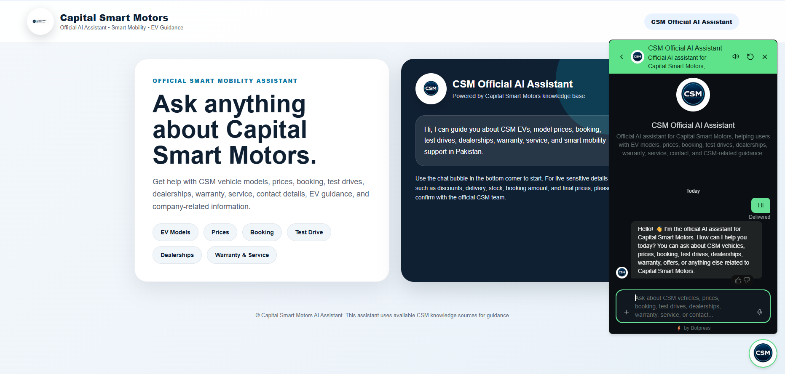

---

## CSM Website Integration

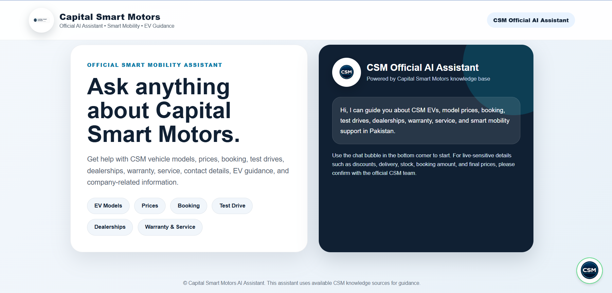

---

# 🧠 Knowledge Base

The chatbot combines multiple knowledge sources to maximize response accuracy.

### Included Knowledge Sources

- Official Capital Smart Motors Website
- Crawled Website Pages
- Custom Knowledge Files
- Essential FAQ Dataset
- Structured Text Documents
- Botpress Vector Knowledge Base

The knowledge retrieval strategy prioritizes internal business information before generating responses using the language model.

---

# 🚀 Deployment

The chatbot is deployed using **Botpress Cloud** and integrated into the Capital Smart Motors website through the official Botpress Webchat embed script.

Deployment includes:

- Website Integration
- Floating Chat Launcher
- Responsive Design
- AI-powered Customer Support
- Real-time Conversations
- Cloud Hosting

---

# 📂 Project Structure

```text
CSM-Official-AI-Assistant/
│
├── assets/
├── docs/
├── knowledge-base/
├── screenshots/
├── webchat/
├── README.md
├── LICENSE
├── .gitignore
├── CHANGELOG.md
├── CONTRIBUTING.md
└── requirements.md
```

---

# 🚀 Future Improvements

Potential future enhancements include:

- Multi-language support
- Voice-enabled interactions
- CRM integration
- Appointment scheduling
- WhatsApp integration
- Live agent handoff
- Advanced analytics dashboard
- User authentication
- Customer feedback collection

---

# 👨‍💻 Author

**Hamza Yaseen**

Business Data Analytics Student

Aspiring Data Analyst & AI Enthusiast

- GitHub: https://github.com/Hamza-Yaseen-Lodhi
- LinkedIn: https://www.linkedin.com/in/hamza-yaseen-499bb9304/

---

# 📜 License

This project is licensed under the MIT License. See the `LICENSE` file for details.

---

<p align="center">

Made with  using Botpress, OpenAI and Retrieval-Augmented Generation (RAG)

</p>
